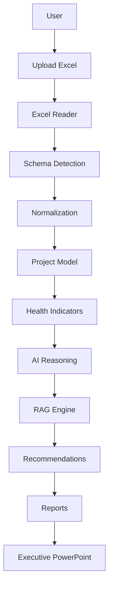

# Project Health Reporting Agent

An AI-powered project management assistant designed to automatically analyze uploaded Excel project plans, evaluate project health using a robust RAG (Red-Amber-Green) framework, and generate executive-ready reports and PowerPoint presentations.

**Problem it Solves:** Project Managers and PMOs spend hours manually consolidating messy Excel data, calculating health metrics, and formatting executive presentations. This agent automates the entire analytical and reporting lifecycle.

**Who it is Built For:** PMOs, Senior Project Managers, Executives, and Client Delivery Teams who require instant, data-backed insights across multiple complex project streams.

---

## 🌟 Features

- **Upload multiple Excel project plans:** Batch analyze single or multiple `.xlsx` workbooks.
- **Automatic schema detection:** Intelligently maps non-standard Excel headers to standard definitions.
- **Dynamic column mapping & Data normalization:** Cleans and normalizes dates, statuses, and numeric progress.
- **Health Indicator Engine:** Mathematically calculates progress, schedule slip, risk saturation, and more.
- **RAG Decision Engine:** Evaluates comprehensive project health into Red, Amber, or Green states.
- **Root Cause Analysis:** AI agent traces failing indicators back to specific tasks or blockers.
- **Stakeholder Sentiment Analysis:** AI agent analyzes unstructured project comments to determine stakeholder confidence.
- **Recommendation Engine:** Generates actionable, context-aware remediation steps.
- **Weekly Project Reports:** Auto-generates detailed markdown-based health reports.
- **Portfolio Analytics:** Synthesizes multiple projects to identify cross-project trends and emerging risks.
- **Executive PowerPoint Generation:** Automatically builds 5–7 slide VP-ready `.pptx` decks.
- **Graceful handling of incomplete data:** Bypasses missing columns without breaking the application.

---

## 🏗 Architecture

The system follows a strict Domain-Driven Design (DDD) decoupling the UI, business logic, and AI layers.



* **Data Layer:** Handles raw file ingestion and fuzzy column mapping.
* **Domain Layer:** Computes hard mathematical constraints (Schedule, Progress, Budget).
* **AI Layer:** Leverages LLMs to synthesize unstructured text, identify root causes, and write summaries.
* **Presentation Layer:** Exposes the results via Streamlit and Python-PPTX.

---

## 📁 Folder Structure

```text
project-health-agent/
├── agents/                  # AI agents (RAG, root cause, recommendations, sentiment)
├── models/                  # Pydantic data models for rigorous schema validation
├── presentations/           # Generated executive PowerPoint files (.pptx)
├── prompts/                 # Externalized JSON prompt templates for LLMs
├── reports/                 # Auto-generated weekly markdown reports
├── services/                # Core business logic
│   ├── health_indicators/   # Rule-based calculators (schedule, progress, risk, etc.)
│   └── presentation/        # python-pptx slide builder engine
├── templates/               # Reusable report layout templates
├── tests/                   # Extensive pytest suite (450+ unit tests)
├── uploads/                 # Temporary isolated storage for Excel plans
├── utils/                   # Helpers (logging, date parsing, UI formatting)
├── app.py                   # Main Streamlit frontend application
├── requirements.txt         # Dependency lockfile
└── README.md                # Project documentation
```

---

## 💻 Technology Stack

| Layer | Technology | Description |
| :--- | :--- | :--- |
| **Backend** | Python 3.10+ | Core language |
| **Frontend** | Streamlit | Interactive, stateful web UI |
| **AI / LLM** | OpenAI GPT-4o-mini | Intelligent reasoning and text synthesis |
| **Data Processing** | Pandas, NumPy | Data manipulation and statistical analysis |
| **Excel Handling** | OpenPyXL | Reading and writing `.xlsx` workbooks |
| **Validation** | Pydantic | Strict data typing and schema enforcement |
| **Reporting** | python-pptx | Native PowerPoint generation |
| **Testing** | Pytest | 450+ automated unit tests |

---

## 🚀 Installation

Follow these steps to set up the project locally:

**1. Clone the repository**
```bash
git clone https://github.com/your-username/project-health-reporting-agent.git
cd project-health-reporting-agent
```

**2. Create and activate a virtual environment**
```bash
# macOS/Linux
python3 -m venv venv
source venv/bin/activate

# Windows
python -m venv venv
venv\Scripts\activate
```

**3. Install dependencies**
```bash
pip install -r requirements.txt
```

---

## ⚙️ Environment Variables

The AI agents require an LLM provider to function.

**1. Create your `.env` file**
```bash
cp .env.example .env
```

**2. Configure your keys inside `.env`**
```env
OPENAI_API_KEY="sk-your-openai-api-key-here"
MODEL_NAME="gpt-4o-mini"
```
*(The system is built to easily adapt to Azure OpenAI, Gemini, or Ollama by extending the `LLMClient` class).*

---

## ▶️ Running the Application

Start the Streamlit application server:

```bash
streamlit run app.py
```
* **Expected URL:** [http://localhost:8501](http://localhost:8501)

---

## 🔄 How It Works

1. **Upload Excel:** The user drags-and-drops raw `.xlsx` project plans into the UI.
2. **Extract Sheets:** The `ExcelReader` locates data sheets, comments, and milestones.
3. **Schema Mapping:** The `SchemaDetector` uses fuzzy matching to map non-standard client columns (e.g., `Task End Date`, `Deadline`) to standard application fields (`end_date`).
4. **Health Indicators:** Rule-based calculators evaluate numerical thresholds (e.g., Schedule Variance, Completion Percentage) instantly.
5. **AI Analysis:** AI agents evaluate unstructured data (comments, descriptions) and correlate failing indicators to find root causes.
6. **Reports:** A weekly operational markdown report is generated per project.
7. **PowerPoint:** A consolidated executive presentation is generated for the entire uploaded portfolio.

---

## 🚦 RAG Evaluation Methodology

The system evaluates Health utilizing strict PMO guidelines combined with AI context:

* **Schedule:** Compares baseline vs. actual completion dates. Identifies overdue tasks.
* **Progress:** Tracks pacing. Ensures the Average % Complete matches expected schedule variance without arbitrarily punishing future backlog tasks.
* **Budget:** Tracks cost variance and burn rates.
* **Milestones:** Evaluates upcoming critical path deliveries.
* **Risks & Blockers:** Measures the volume, severity, and mitigation status of logged impediments.
* **Dependencies:** Checks for external or cross-team bottlenecks.
* **Stakeholder Sentiment:** AI evaluates unstructured comments to detect frustration, alignment, or confidence.

These individual scores are algorithmically weighted to produce the final **RAG (Red / Amber / Green)** score.

---

## 🧠 AI Components

The application utilizes highly specialized AI sub-agents rather than a monolithic prompt:

* **Stakeholder Sentiment Agent:** Reads raw team comments to gauge morale, alignment, and confidence.
* **Root Cause Analysis Agent:** Investigates *why* a project turned AMBER or RED by cross-referencing blockers, schedule slips, and comments.
* **Recommendation Agent:** Formulates highly specific, actionable remediation steps (e.g., "Escalate Task 45 to the DB team due to 3-week dependency slip").
* **Portfolio Analytics Agent:** Synthesizes the entire batch of uploaded projects to spot systemic trends (e.g., "Resource bottlenecks detected across all 3 backend projects").

---

## 🏆 Project Highlights

* **Production-Ready Architecture:** Clean separation of concerns (SOLID principles).
* **Dynamic Schema Mapping:** Resilient to messy, inconsistent client Excel files.
* **Graceful Fallback Logic:** Rule-based logic instantly takes over if the LLM provider fails or times out.
* **Modular AI Agents:** Granular Pydantic-enforced structured outputs prevent hallucinations.
* **Strong Error Handling:** Safe `.fillna()` operations, type checking, and robust exception catching.

---

## 🔮 Future Improvements

- **Predictive Risk Analytics:** Using historical data to forecast slippage before it occurs.
- **Budget Forecasting:** Advanced Monte Carlo simulations for cost overruns.
- **Live Integrations:** Two-way sync with **Jira**, **Asana**, and **Microsoft Project**.
- **Power BI Integration:** Exporting normalized data models directly into BI tools.
- **Automated Alerts:** Slack / Microsoft Teams notifications triggered by cron-scheduled cloud deployments.

---


## 🤝 Contributing

Contributions are welcome! Please ensure that all pull requests pass the existing Pytest suite.
```bash
pytest tests/ -v
```

---

## ⚖️ License

This project is licensed under the MIT License. See the `LICENSE` file for details.
